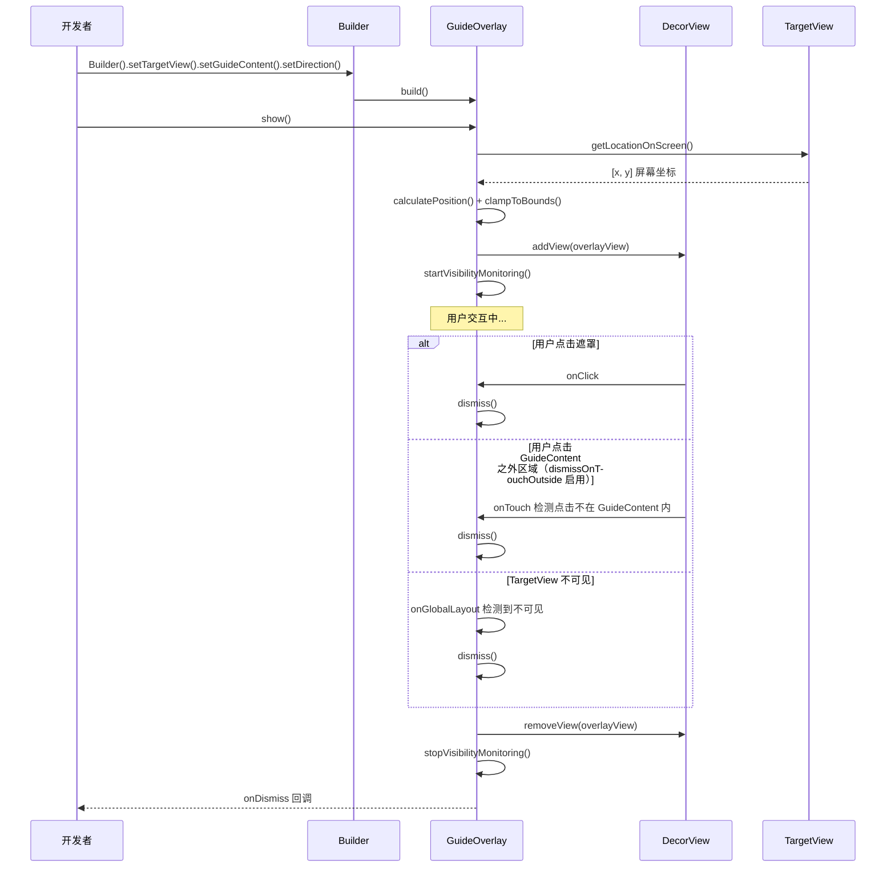

# GuideOverlay 技术设计文档

## 概述

GuideOverlay 是一个轻量级的引导浮层组件，用于在目标 View 的上、下、左、右四个方向显示引导内容，并与目标 View 居中对齐。组件采用 Builder 模式构建，添加到 Activity 的 DecorView 上实现全屏覆盖。

核心设计决策：
- 使用 Kotlin 编写，与项目现有风格一致
- Builder 模式参考 `App.java` 的实现风格
- 引导浮层直接添加到 DecorView，避免侵入现有布局层级
- 定位计算基于 `getLocationOnScreen()` 获取绝对坐标，确保跨布局层级的准确定位
- 通过 `ViewTreeObserver.OnGlobalLayoutListener` 监听 TargetView 可见性变化

## 架构

```mermaid
classDiagram
    class Direction {
        <<enum>>
        TOP
        BOTTOM
        LEFT
        RIGHT
    }

    class OnDismissListener {
        <<interface>>
        +onDismiss()
    }

    class GuideOverlay {
        -targetView: View
        -guideContent: View
        -direction: Direction
        -overlayBackgroundEnabled: Boolean
        -dismissOnTouchOutside: Boolean
        -backgroundColor: Int
        -onDismissListener: OnDismissListener?
        -overlayView: FrameLayout?
        -visibilityListener: OnGlobalLayoutListener?
        +show()
        +dismiss()
        -calculatePosition(): Point
        -clampToBounds(x: Int, y: Int, contentW: Int, contentH: Int, screenW: Int, screenH: Int): Point
        -startVisibilityMonitoring()
        -stopVisibilityMonitoring()
        -isTargetVisible(): Boolean
    }

    class Builder {
        -targetView: View?
        -guideContent: View?
        -direction: Direction
        -overlayBackgroundEnabled: Boolean
        -dismissOnTouchOutside: Boolean
        -backgroundColor: Int
        -onDismissListener: OnDismissListener?
        +setTargetView(view: View): Builder
        +setGuideContent(view: View): Builder
        +setDirection(direction: Direction): Builder
        +setOverlayBackgroundEnabled(enabled: Boolean): Builder
        +setDismissOnTouchOutside(enabled: Boolean): Builder
        +setBackgroundColor(color: Int): Builder
        +setOnDismissListener(listener: OnDismissListener): Builder
        +build(): GuideOverlay
    }

    GuideOverlay --> Direction
    GuideOverlay --> OnDismissListener
    GuideOverlay +-- Builder
    GuideOverlay +-- Direction
    GuideOverlay +-- OnDismissListener
```

组件交互流程：



## 组件与接口

### Direction 枚举

```kotlin
package com.qw.framework.guide

enum class Direction {
    TOP, BOTTOM, LEFT, RIGHT
}
```

### OnDismissListener 接口

```kotlin
package com.qw.framework.guide

fun interface OnDismissListener {
    fun onDismiss()
}
```

### GuideOverlay 类

```kotlin
package com.qw.framework.guide

class GuideOverlay private constructor(
    private val targetView: View,
    private val guideContent: View,
    private val direction: Direction,
    private val overlayBackgroundEnabled: Boolean,
    private val dismissOnTouchOutside: Boolean,
    private val backgroundColor: Int,
    private val onDismissListener: OnDismissListener?
) {
    private var overlayView: FrameLayout? = null
    private var visibilityListener: ViewTreeObserver.OnGlobalLayoutListener? = null

    fun show() { ... }
    fun dismiss() { ... }

    class Builder {
        private var targetView: View? = null
        private var guideContent: View? = null
        private var direction: Direction = Direction.BOTTOM
        private var overlayBackgroundEnabled: Boolean = true
        private var dismissOnTouchOutside: Boolean = false
        private var backgroundColor: Int = 0x80000000.toInt()
        private var onDismissListener: OnDismissListener? = null

        fun setTargetView(view: View): Builder { ... }
        fun setGuideContent(view: View): Builder { ... }
        fun setDirection(direction: Direction): Builder { ... }
        fun setOverlayBackgroundEnabled(enabled: Boolean): Builder { ... }
        fun setDismissOnTouchOutside(enabled: Boolean): Builder { ... }
        fun setBackgroundColor(color: Int): Builder { ... }
        fun setOnDismissListener(listener: OnDismissListener): Builder { ... }
        fun build(): GuideOverlay { ... }
    }
}
```

### 核心算法

#### 1. 定位计算 `calculatePosition()`

根据 TargetView 的屏幕坐标和尺寸，以及 GuideContent 的测量尺寸，计算 GuideContent 的放置坐标：

```
输入：
  targetLoc: IntArray  // TargetView 屏幕坐标 [x, y]
  targetW, targetH: Int  // TargetView 宽高
  contentW, contentH: Int  // GuideContent 测量宽高

算法：
  targetCenterX = targetLoc[0] + targetW / 2
  targetCenterY = targetLoc[1] + targetH / 2

  when (direction) {
    TOP -> {
      x = targetCenterX - contentW / 2
      y = targetLoc[1] - contentH
    }
    BOTTOM -> {
      x = targetCenterX - contentW / 2
      y = targetLoc[1] + targetH
    }
    LEFT -> {
      x = targetLoc[0] - contentW
      y = targetCenterY - contentH / 2
    }
    RIGHT -> {
      x = targetLoc[0] + targetW
      y = targetCenterY - contentH / 2
    }
  }
```

#### 2. 边界钳制 `clampToBounds()`

居中对齐后，检查 GuideContent 是否超出屏幕边界，若超出则贴齐对应边界：

```
输入：
  x, y: Int  // calculatePosition 计算出的坐标
  contentW, contentH: Int  // GuideContent 宽高
  screenW, screenH: Int  // 屏幕宽高

算法：
  clampedX = when {
    x < 0 -> 0
    x + contentW > screenW -> screenW - contentW
    else -> x
  }
  clampedY = when {
    y < 0 -> 0
    y + contentH > screenH -> screenH - contentH
    else -> y
  }
  return Point(clampedX, clampedY)
```

#### 3. 可见性监听

通过 `ViewTreeObserver.OnGlobalLayoutListener` 监听布局变化，在每次回调中检查 TargetView 及其所有父容器的可见性：

```
fun isTargetVisible(): Boolean {
  var view: View? = targetView
  while (view != null) {
    if (view.visibility != View.VISIBLE) return false
    view = view.parent as? View
  }
  return true
}
```

### show() 流程

1. 获取 DecorView：`(targetView.context as Activity).window.decorView as FrameLayout`
2. 创建 `overlayView = FrameLayout(context)` 并设置 `MATCH_PARENT` 布局参数
3. 若 `overlayBackgroundEnabled`，设置 `overlayView` 背景色并注册点击事件调用 `dismiss()`
4. 若 `dismissOnTouchOutside`，在 `overlayView` 上注册点击事件，当点击区域不在 GuideContent 范围内时调用 `dismiss()`
5. 等待 TargetView 布局完成（若 `targetView.width == 0`，使用 `post {}` 延迟）
5. 测量 GuideContent（`measureChild` 使用 `AT_MOST` 约束）
6. 调用 `calculatePosition()` 和 `clampToBounds()` 计算最终坐标
7. 设置 GuideContent 的 `FrameLayout.LayoutParams`，通过 `leftMargin` 和 `topMargin` 定位
8. 将 GuideContent 添加到 `overlayView`，将 `overlayView` 添加到 DecorView
9. 调用 `startVisibilityMonitoring()`

### dismiss() 流程

1. 调用 `stopVisibilityMonitoring()`
2. 从 DecorView 移除 `overlayView`
3. 回调 `onDismissListener?.onDismiss()`
4. 置空 `overlayView`

## 数据模型

本组件不涉及持久化数据。运行时数据结构如下：

| 字段 | 类型 | 说明 |
|------|------|------|
| targetView | View | 目标视图引用 |
| guideContent | View | 引导内容视图引用 |
| direction | Direction | 显示方向枚举 |
| overlayBackgroundEnabled | Boolean | 是否显示遮罩背景 |
| dismissOnTouchOutside | Boolean | 是否点击外部区域自动关闭 |
| backgroundColor | Int | 遮罩背景颜色（ARGB） |
| onDismissListener | OnDismissListener? | 关闭回调 |
| overlayView | FrameLayout? | 运行时创建的浮层容器 |
| visibilityListener | OnGlobalLayoutListener? | 可见性监听器引用 |


## 正确性属性

*属性（Property）是在系统所有有效执行中都应保持为真的特征或行为——本质上是关于系统应该做什么的形式化陈述。属性是人类可读规范与机器可验证正确性保证之间的桥梁。*

### 属性 1：方向定位与居中对齐

*对于任意* TargetView 屏幕坐标 (tx, ty)、TargetView 尺寸 (tw, th)、GuideContent 尺寸 (cw, ch) 和任意 Direction，`calculatePosition()` 应满足：
- 当 Direction 为 TOP 时：`y = ty - ch` 且 `x = tx + tw/2 - cw/2`
- 当 Direction 为 BOTTOM 时：`y = ty + th` 且 `x = tx + tw/2 - cw/2`
- 当 Direction 为 LEFT 时：`x = tx - cw` 且 `y = ty + th/2 - ch/2`
- 当 Direction 为 RIGHT 时：`x = tx + tw` 且 `y = ty + th/2 - ch/2`

即：GuideContent 紧邻 TargetView 放置，且在垂直于方向的轴上与 TargetView 中心对齐。

**验证需求: 2.2, 2.3, 2.4, 2.5, 3.1, 3.2**

### 属性 2：边界钳制保证屏幕内显示

*对于任意* 输入坐标 (x, y)、GuideContent 尺寸 (cw, ch) 和屏幕尺寸 (sw, sh)，`clampToBounds()` 的输出 (cx, cy) 应满足：
- `0 <= cx` 且 `cx + cw <= sw`
- `0 <= cy` 且 `cy + ch <= sh`

即：钳制后的 GuideContent 完全位于屏幕范围内。

**验证需求: 3.3, 3.4, 3.5, 3.6**

### 属性 3：边界钳制的最小偏移性

*对于任意* 输入坐标 (x, y)、GuideContent 尺寸 (cw, ch) 和屏幕尺寸 (sw, sh)，`clampToBounds()` 的输出 (cx, cy) 应满足：
- 若原始 `x` 已在 `[0, sw - cw]` 范围内，则 `cx == x`（不做不必要的偏移）
- 若原始 `y` 已在 `[0, sh - ch]` 范围内，则 `cy == y`（不做不必要的偏移）

即：钳制操作是幂等的——对于已在屏幕内的坐标不产生任何变化。

**验证需求: 3.3, 3.4, 3.5, 3.6**

### 属性 4：Builder 必填参数校验

*对于任意* Builder 配置组合，若 TargetView 或 GuideContent 未设置，则 `build()` 应抛出 `IllegalArgumentException`；若两者均已设置，则 `build()` 应成功返回 GuideOverlay 实例。

**验证需求: 1.8, 1.9**

## 错误处理

| 场景 | 处理方式 |
|------|----------|
| TargetView 未设置时调用 build() | 抛出 `IllegalArgumentException("targetView must be set")` |
| GuideContent 未设置时调用 build() | 抛出 `IllegalArgumentException("guideContent must be set")` |
| TargetView 尚未完成布局（width/height 为 0） | 使用 `targetView.post {}` 延迟到下一帧执行定位计算 |
| TargetView 所在 Activity 已销毁 | `show()` 中检查 Context 是否为有效 Activity，若无效则静默返回 |
| 重复调用 `show()` | 若 `overlayView` 已存在，先调用 `dismiss()` 再重新显示 |
| 重复调用 `dismiss()` | 若 `overlayView` 为 null，静默返回，避免重复操作 |

## 测试策略

### 单元测试

单元测试聚焦于具体示例和边界条件：

1. Builder 默认值验证：未设置 Direction 时默认为 BOTTOM，未设置 overlayBackgroundEnabled 时默认为 true，未设置 backgroundColor 时默认为 0x80000000
2. Builder 必填参数校验：未设置 TargetView 时 build() 抛出异常，未设置 GuideContent 时 build() 抛出异常
3. dismiss 回调验证：设置 OnDismissListener 后调用 dismiss()，验证回调被触发

### 属性测试

属性测试使用 [Kotest](https://kotest.io/) 的 Property Testing 模块（`kotest-property`），每个属性测试至少运行 100 次迭代。

每个测试需通过注释标注对应的设计属性：

```kotlin
// Feature: guide-overlay, Property 1: 方向定位与居中对齐
```

属性测试覆盖：

1. **定位计算属性测试**：生成随机的 TargetView 坐标、尺寸和 GuideContent 尺寸，验证 `calculatePosition()` 对四个方向的输出满足属性 1 的公式
2. **边界钳制属性测试**：生成随机坐标和尺寸，验证 `clampToBounds()` 输出始终在屏幕范围内（属性 2）
3. **边界钳制幂等性测试**：生成已在屏幕内的随机坐标，验证 `clampToBounds()` 不改变坐标（属性 3）
4. **Builder 校验属性测试**：生成随机的 Builder 配置组合（targetView 和 guideContent 的有无），验证 build() 的成功/失败行为与属性 4 一致

### 测试依赖

```groovy
testImplementation "io.kotest:kotest-runner-junit5:5.8.0"
testImplementation "io.kotest:kotest-property:5.8.0"
```

注意：`calculatePosition()` 和 `clampToBounds()` 应设计为纯函数（或 `internal` 可见性的伴生对象方法），以便在不依赖 Android 环境的情况下进行单元测试和属性测试。
